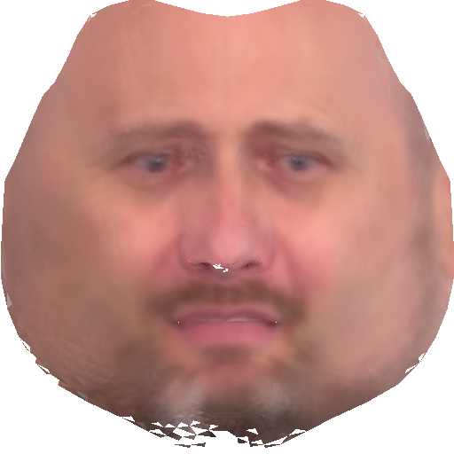
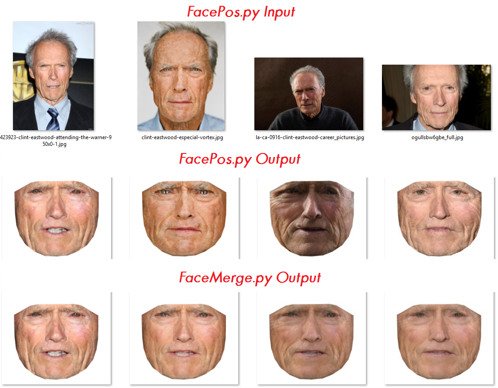
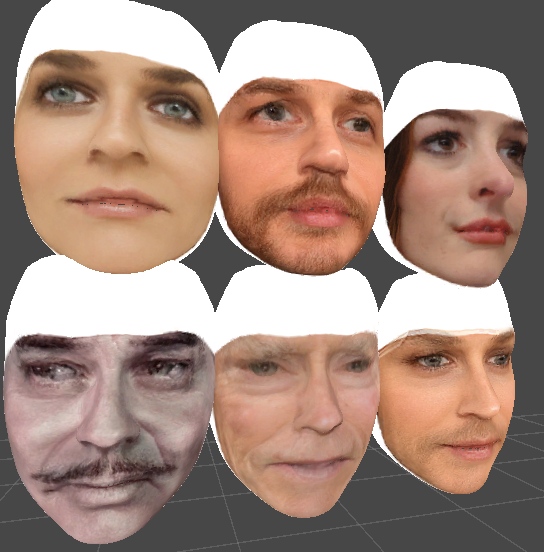
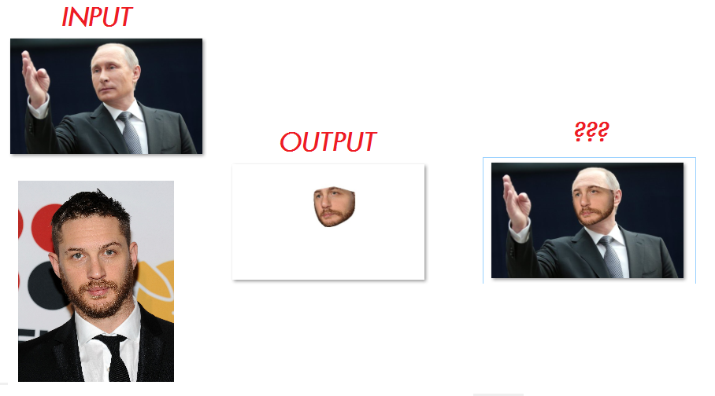

# Faceo 0.1

Extract face from photos and reorient them based on an input face.

I can't afford an artist atm, so I wrote this to create quick temporary texture for characters in a game. Simply give it a face texture to go off of, it will use opencv and dlib to find the points, then it will go through a folder of images, extracting faces and orienting them for you. But you could use it for more than just game textures.

## Overview
Given a template face texture like:

and a folder of faces, you'll get a folder of faces aligned to the template.
Which could be optionally merged with faceMerge.py:

These are some in Unity examples of how the results could be used.
(None of this was touched up, and they are all sharing the same face model, but it gives a rough idea.)

But the scripts could be used however you want:

## Requirements
* numpy
* opencv
* dlib

and if you want to use the image enhance feature in faceMerge.py
* wand

## Future plans (Will probably never be implemented.)
* GUI + Precompiled .exe
* Get face pose/rotation, then only grab triangles from side of face closest to camera. (For better quality.)
* Get foreheads.
* Use an emotion processor to merge images by emotion. These could then be blended in game?
